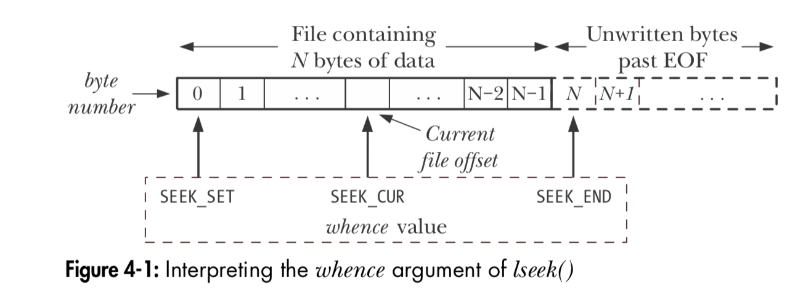

# TLPI 第四章

### 4.7 `lseek()`: 修改文件的偏移量（offset）

- **offset** = **read-write offset** = **pointer**

  单位：byte

  是下一次`read()`或`write()`执行的位置

- 当文件打开的时候，`offset = 0`
- 当文件进行`read()`、`write()`的时候，offset自动进行调整
- 使用`lseek`系统函数，可以修改文件offset的值：

```c
#include <unistd.h>

/* Returns new file offset if successful, or –1 on error */
off_t lseek(int fd, off_t offset, int whence);
```

其中，`whence`表示偏移量计算的基础位置在哪里：

  1. `SEEK_SET`：文件的开始处
  2. `SEEK_CUR`：文件的当前偏移量
  3. `SEEK_END`：文件最后一个字节的下一个字节

如下图所示：



- 若`whence`为`SEEK_END`或`SEEK_CUR`则`offset`可以取**负数**。

  若`whence`为`SEEK_SET`则`offset`必须为**正数**

- 举例：

```c
lseek(fd, 0, SEEK_SET);      /* 文件开始处 */
lseek(fd, 0, SEEK_END);      /* 文件最后一个字节的下一个字节处 */
lseek(fd, -1, SEEK_END);     /* 文件最后一个字节处 */
lseek(fd, -10, SEEK_CUR);    /* 文件当前offset前面10个字节处 */
lseek(fd, 10000, SEEK_END);  /* 文件最后一个字节后10000个字节处 */
```

### 4.8 Universal I/O模型外的操作：`ioctl()`

- `ioctl`系统调用是处理**Universal I/O**外部操作的通用机制。

```c
#include <sys/ioctl.h>

/* Value returned on success depends on request, or –1 on error */
int ioctl(int fd, int request, ... /* argp */);
```

- `fd`：打开文件的修饰符
- `request`：代表控制命令的编号
- `...`：根据`request`的不同，可能是指向`int`或`struct`的指针，也可能不用到这个参数。

- ⚠️ 注意！`ioctl`在SuSV*中没有明确的定义，可能有**兼容性问题**！

### 4.9 总结

1. 对**普通文件（*regular file*）**进行**I/O操作**之前，我们首先需要调用`open()`方法获得一个**文件修饰符(*file descriptor*)**

2. I/O操作是基于`read()`与`write()`方法进行的。
3. I/O操作结束后，我们需要调用`close`方法，释放文件修饰符（fd）。
4. **通用I/O模型（*Universal I/O Model*）**让我们能够用同样的代码处理各种类型的文件，不需要因为文件类型不同写针对性的代码。
5. 对于每个打开的文件，内核维护一个**偏移量（*offset*）**来决定下一次`read()`与`write()`操作执行的位置。
   每次进行`read()`、`write()`，`offset`的值自动进行更新。
   可以调用`lseek()`方法，显式地指定`offset`的值。
6. 在一个文件末尾之后的位置写入内容，会导致**文件空洞（*file hole*）**的产生。从文件空洞中读取内容，会读到`'\0'`（零字符）
7. `ioctl()`系统调用处理所有通用I/O模型外的操作。