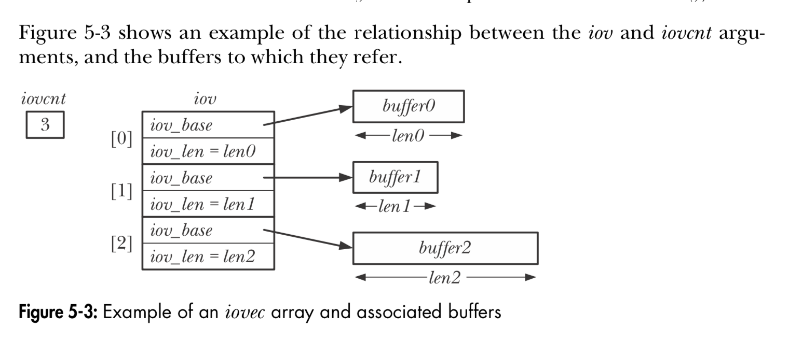

# TLPI 第五章

### 5.1 原子性操作

- 所有单独的syscall均为**原子操作**，但syscall的组合不一定是。

- 例如：

  1. 先打开文件判断是否存在，
  2. 若不存在则重新打开文件，

  那么，在(1.)跟(2.)之间若有别的进程创建了同名的文件，就无法保证(2.)创建的文件一定是自己创建的了。

  ⚠️ 正确做法：使用`O_EXCL | O_CREAT`标识位打开文件

```c
fd = open("/path/to/file", O_EXCL | O_CREAT /* other code omitted... */);
```


- 再比如如下代码：

```c
/* Step 1 */
if (lseek(fd, 0, SEEK_END) == -1) {
  	errExit("lseek");
}
/* Step 2 */
if (write(fd, buf, len) != len) {
  	fatal("Partial/failed write");
}
```

​	在Step 1与Step 2之间，若有别的进程也移动了offset，则有可能其中一个进程会覆盖另一个进程写入的数据。

​	⚠️ 正确做法：使用O_APPEND标识位

```c
fd = open("/path/to/file", O_APPEND /* other code omitted... */);
```


### 5.2 *`fcntl()`*

*`fcntl`*系统调用可以对打开的文件执行各种操作：

```c
#include <fcntl.h>

/* Return on success depends on cmd, or –1 on error */
int fcntl(int fd, int cmd, ...);
```

- `cmd`：要执行的命令
- `...`：根据`cmd`的不同，需要不同的参数，或者忽略该参数。

### 5.3 open file status flag

- 读取文件的**status flag**：

```c
int flags, accessMode;

flags = fcntl(fd, F_GETFL);  /* Third argument is not required */
if (flags == -1) {
  errExit("fcntl");
}
```

​	可以以此检测文件是否为**同步写**：

```c
if (flags & O_SYNC) {
  printf("writes are synchronized\n")
}
```

​	读取文件的**access mode**如下：

```c
accessMode = flags & O_ACCMODE;
if (accessMode == O_WRONLY || accessMode == O_RDWR) {
  printf("write is writable\n");
}
```

- 修改文件的**status flag**

  允许修改的flag为：

  - `O_APPEND`
  - `O_NONBLOCK`
  - `O_NOATIME`
  - `O_ASYNC`
  - `O_DIRECT`

  修改其他的flags会被忽略。（某些UNIX系统允许修改其他flags，如`O_SYNC`）

- 调用`fcntl()`的常用场景：

  - 文件不是由当前程序打开的，无法直接通过`open`方法的参数进行操控
  - 文件不是用`open`打开的，而是用别的方法（例如`pipe()`、`socket()`）

- 调用`fcntl()`的步骤：

  1. 使用`GET_FL`读取当前文件的flags
  2. 修改flags上需要修改的flag
  3. 使用`SET_FL`修改文件的flags

  如下方式可以激活`O_APPEND`位：

```c
int flags;

/* STEP 1: GET flags */
flags = fcntl(fd, F_GETFL);
if (flags == -1) {
  errExit("fcntl");
}

/* STEP 2: MODIFY flags */
/* to enable O_APPEND */
flags |= O_APPEND;

/* STEP 3: SET flags */
if (fcntl(fd, F_SETFL, flags) == -1) {
  errExit("fcntl");
}
```


### 5.4 文件修饰符与已打开文件的关系

- 一个文件可能对应多个文件修饰符。
- 三种重要数据结构：
  - per-process file descriptor table
  - system-wide table of open file descriptors
  - file system i-node table
- 对于每个进程，内核维护一个**table of *open file descriptors***。每一条记录对应着一个**file descriptor**相关的信息，包括：
  - 一组标识位，用来控制该文件修饰符的操作列表。
  - 指向**文件描述信息（*open file description*）**的引用。
- 内核维护一个**系统级别**的表，包含所有的***open file descriptors***。

- 文件描述信息的内容有：
  - 文件偏移量(***offset***)
  - *status* flags，调用`open()`方法时指定的（第二个参数）
  - *file access mode*，调用`open()`方法时指定（第三个参数）``
  - *signal-driven I/O*相关的设置
  - 指向文件***i-node object***的引用
- 每个文件系统都有一个***i-nodes***表，维护所有文件的***i-node***信息。
  i-node的内容如下：
  - 文件类型与权限
  - 指向该文件lock列表的指针
  - 文件的多种属性，例如**文件大小**、**相关操作的时间戳**

示意图如下：


- 总结：
  - 同一个*open file*的多个文件修饰符共享同一个*offset*。
  - 同一个*open file*的多个文件修饰符共享相同的*open file status*（如`O_APPEND`、`O_NONBLOCK`、`O_ASYNC`）。
  - 不同的文件修饰符具有不同的`file descriptor flags`（即`close-on-exec`flag）。

### 5.5 *`dup()`*与*`dup2()`

- `dup()`可以根据一个*file descriptor*创建一个新的：

```c
#include <unistd.h>

/* Returns (new) file descriptor on success, or –1 on error */
int dup(int old_fd);
```

​	返回的*new file descriptor*为下一个最小的*file descriptor*。

- `dup2()`可以指定*new file descriptor*的号码：

```c
#include <unistd.h>

/* Returns (new) file descriptor on success, or –1 on error */
int dup2(int old_fd, int new_fd);
```

​	若`new_fd`已经存在了，则关闭`new_fd`，然后打开。

​	若`close(new_fd)`操作报错，系统自动忽略并继续。应该自己检测`new_fd`是否存在并显示地进行关闭。

- 使用`fcntl()`可以增加一些灵活性：

```c
/* 返回一个新的file descritpor，
/* 且是大于或等于start_fd的最小未使用的fd */
new fd = fcntl(old_fd, F_DUPFD, start_fd);
```

​	`dup()`或`dup2()`均可以替换为`close()` + `fcntl`，但某些返回错误码不太一样。

- 使用`dup3()`可以显示地指定复制出来的`file descriptor`的flags：

```c
#define _GNU_SOURCE
#include <unistd.h>

/* Returns (new) file descriptor on success, or –1 on error */
int dup3(int old_fd, int new_fd, int flags);
```

​	目前支持的flags有`O_CLOEXEC`。

​	自从*linux 2.6.24*后，`fctnl`也支持`F_DUPFD_CLOEXEC`标识位，与`dup3()`的`O_CLOEXEC`flag类似。

### 5.6 File I/O at specific offset: *`pread()`* and *`pwrite()`*

```c
#include <unistd.h>

/* Returns number of bytes read, 0 on EOF, or –1 on error */
ssize_t pread(int fd, void *buf, size_t count, off_t offset);

/* Returns number of bytes written, or –1 on error */
ssize_t pwrite(int fd, void *buf, size_t count, off_t offset);
```

调用`pread()`相当于如下调用：

```c
off_t orig;

// Save current offset
orig = lseek(fd, 0, SEEK_CUR);
// Modify offset
lseek(fd, offset, SEEK_SET);
// Do write
write(fd, buf, count);
// Restore offset
lseek(fd, orig, SEEK_SET);
```

### 5.7 Scatter-Gather I/O: *readv()* and *writev()*

```c
#include <sys/uio.h>

/* Returns number of bytes read, 0 on EOF, or –1 on error */
ssize_t readv(int fd, const struct iovec *iov, int iovcnt);

/* Returns number of bytes written, or –1 on error */
ssize_t writev(int fd, const struct iovec *iov, int iovcnt);
```

该I/O可以通过一次系统调用直接读/写多个缓存数据，这些缓存数据储存在名为`iov`的数组结构中，`iovcnt`为数组的大小（即要操作的缓存数据数量）

`iovec`的结构如下：

```c
struct iovec {
  	/* Start address of buffer */
  	void *iov_base;
  	/* Number of bytes to transfer to/from buffer */
  	size_t iov_len;
}
```



- *Linux 2.6.30*提供`preadv()`与`pwritev()`系统调用，可以在指定offset处执行**Scatter I/O**

```c
#define _BSD_SOURCE
#include <sys/uio.h>

/* Returns number of bytes read, 0 on EOF, or -1 on error */
ssize_t preadv(int fd, const iovec* iov, int iovcnt, off_t offset);

/* Returns number of bytes written, or –1 on error */
ssize_t pwritev(int fd, const iovec *iov, int iovcnt, off_t offset);
```

### 5.8 Truncate a file: *`truncate()`* and *`ftruncate()`*

使用*`truncate()`* 与 *`ftruncate()`*可以截断/补充文件，将文件大小设置为`length`：

```c
#include <unistd.h>

/* Both return 0 on success, or –1 on error */
int truncate(const char *pathname, off_t length);
int ftruncate(int fd, off_t length);
```

- 若文件大于`length`，则超过的部分会丢失。
  若文件小于`length`，则少的部分会用'\0'或者*文件空洞*来补充。
- **`truncate`**系统调用是唯一一个不需要*file descriptor*而是直接使用*文件路径*修改文件内容的**系统调用**

### 5.9 Nonblocking I/O

打开文件时指定（或者调用`fcntl()`）`O_NONBLOCK`以使用**Nonblocking I/O**。

- 如果文件无法立刻打开，`open`返回错误，而不是阻塞。
  例如：使用***FIFO***时。
- 文件已经打开后，对文件执行读/写，若I/O系统不能立刻完成操作，则要么执行**部分读写**，要么返回错误`EAGAIN`或者`EWOULDBLOCK`。

**Nonblocking mode**一般用于设备（*terminal*或*pseudoterminal*）、*pipes*、*FIFOs*、*sockets*。对于*pipes*与*sockets*，由于不是使用`open()`打开的文件，因此需要显示地调用`fcntl()`以设置`O_NONBLOCK`。

普通文件一般不需要使用`O_NONBLOCK`，但当使用*文件锁*时，会起效果。

### 5.10 Very large files (`> 2^31-1`)

### 5.11 The /dev/fd directory

对于每个*process*来说，系统创建一个*虚拟目录***/dev/fd/n**用于记录该进程打开所有文件的*file descriptor*。例如，*/dev/fd/1*表示**标准输出流**。

打开一个*/dev/df*的文件相当于`dup`对应的*file descriptor*。例如：

```c
fd = open("/dev/fd/1", O_WRONLY);
```

相当于

```c
/* Duplicate standard output */
fd = dup(1);
```

该机制一般用于*shell*。例如，使用*/dev/fd/0*可代表标准输入流：

```bash
ls | diff /dev/fd/0 oldfilelist 
```

- */dev/stdin* 相当于 */dev/fd/0*
- */dev/stdout* 相当于 */dev/fd/1*
- */dev/stderr* 相当于 */dev/fd/2*

### 5.12 临时文件

*GNU C library* 提供了一组方法，用于操纵临时文件。

- `mkstemp()`：根据指定的*template*创建一个唯一的文件名，打开文件，返回文件修饰符。

```c
#include <stdlib.h>

/* Returns file descriptor on success, or –1 on error */
int mkstemp(char *template);
```

1. `template`最后6个字符必须为`"XXXXXX"`，以替换生成唯一的文件名。
   函数返回时，`template`被修改为生成的文件名，故不能使用`const char*`。
2. `mkstemp()`创建的文件具有用户读写权限，其他用户没有权限。
   该文件具有`O_EXCL` flag，保证用户具有*exclusive access*。
3. 调用`unlink()`系统调用可以*unlink*一个临时文件。
   临时文件通用的使用方式为：

```c
int fd;
char template[] = "/tmp/somethingXXXXXX";

fd = mkstemp(template);
if (fd == -1) {
  	errExit("mkstemp");
}
printf("Generated filename was: %s\n", template);
/* Name disappears immediately, but the file */
/* is removed only after close() */
unlink(template);

/* Use file I/O system calls - read(), write(), and so on */

if (close(fd) == -1) {
  	errExit("close");
}
```

- `tmpfile()`函数可直接生成一个唯一命名的文件。该文件自带`O_EXCL` flag以保证该文件必定由该进程创建。

```c
#include <stdio.h>

/* Returns file pointer on success, or NULL on error */
FILE *tmpfile(void);
```

### 5.13 Summary

- 原子性：
  `O_EXCL`：*exclusive access*
  `O_APPEND`：*multiple process write won't overwrite each other*
- `fcntl`系统调用可用于多种文件操作，包括*改变打开文件的flag*或*复制file descriptor*。
  *复制file descriptor*也可使用`dup()`、`dup2()`、`dup3()`系统调用。
- *file descriptor*、*open file description*与*file i-node*的关系。
  复制一个*file descriptor*对应相同的*offset*、*open file status flag*，但具有不同的*close-on-exec* flag
- 其他read、write方法：
  - 指定offset读写：`pread()`、`pwrite()`
  - Scatter-gather I/O：`readv()`、`writev()`
  - 结合I/O：`preadv()`、`pwritev()`

- `truncate()`与`ftruncate()`系统调用可用于截断文件。
- Non-blocking I/O
- LFS specification与大文件读写。
- */dev/fd*对应进程打开的文件修饰符。
- `mkstemp`、`unlink`与`tmpfile`库函数。